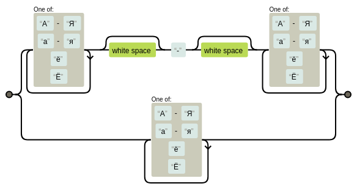
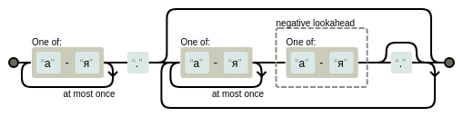
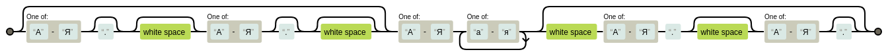
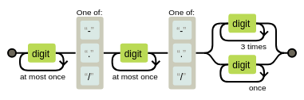
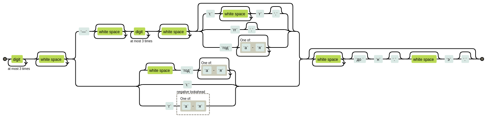
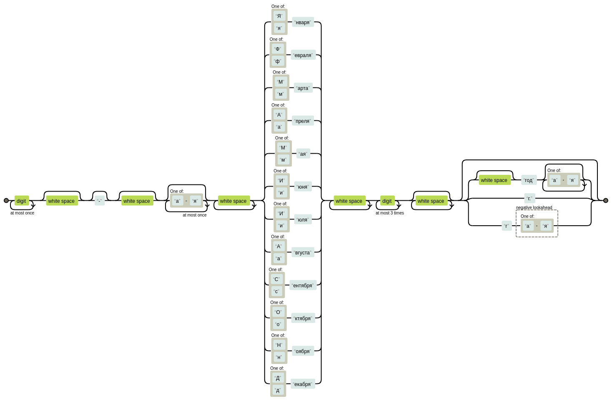
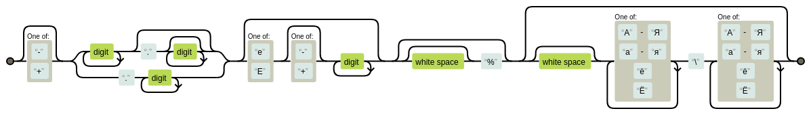
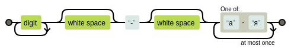
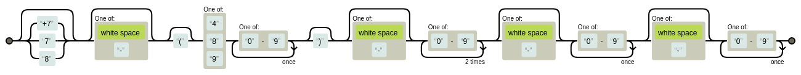
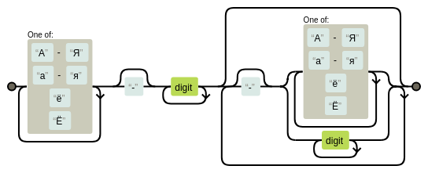

#  Домашнее задание №1
## Алиев М.А. группа 154
### Тема - реализация графематического анализатор с помощью регулярных выражений

#### Введение

_Токенизация_ — это самый первый шаг при обработке текста. Заключается в разбиении (разделении) длинных строк текста в более мелкие: абзацы делим на предложения, предложения на слова. Токенизация обычно считается легкой относительно других задач на естественном языке и одной из наиболее неинтересных задач. Однако ошибки, сделанные на этом этапе, будут распространяться на более поздние этапы и вызывать проблемы, поэтому очень важно постараться допустить на этом шаге минимум промахов, а еще лучше не допустить вообще, однако, наврядли это возможно, учитывая, что мы анализируем естественный язык, который практически невозможно полностью систематизировать.

На Python уже существует довольно неплохой пакет для NLP - NLTK, впрочем, качество его токенизации на русскоязычных текстах оставляет желать лучшего и с трудом превосходит результат обычного разбиения по пробелу. В своем токенизаторе в качестве инструмента я буду использовать регулярные выражения и "инженерный" подход. С помощью набора шаблонов я попытаюсь описать самые часто используемые сложные "токены" — телефонные номера, даты, аббревиатуры, имена, какие-то модели техники и т.д. Минус такого подхода в том, что невозможно создать универсальный шаблон — в зависимости от специфики текста могут потребоваться совсем другие правила разбиения: техническая статья может изобиловать сложными формулами и числами, медицинская — химическими формулами и сокращениями. В NLTK, например, есть отдельный токенизатор для Twitter. Конечно, не будем забывать и о варианте, использующем машинное обучение, однако для этого требуется большое количество размеченных текстов и машина с хорошой вычислительной мощностью.

#### Определяем простые слова
Начнем с самого просто - обычных слов, представляющих из себя последовательность букв.


```python
import re

word = "(?:[А-Яа-яёЁ]+)"
print (re.findall(word, 'Напиток имел терпко-сладкий вкус, как-будто был сделан из мёда.'))
```

    ['Напиток', 'имел', 'терпко', 'сладкий', 'вкус', 'как', 'будто', 'был', 'сделан', 'из', 'мёда']


Как видно, все слова были корректно определены в токены, однако некоторые выражения, написанные через дефис, могут потерять часть смысла при разделении, поэтому добавим в правило использование дефиса.


```python
# обычные слова и слова через дефис
word = "(?:(?:[А-Яа-яёЁ]+\s?\-\s?[А-Яа-яёЁ]+)|(?:[А-Яа-яёЁ]+))"
print (re.findall(word, 'Напиток имел терпко-сладкий вкус, как-будто был сделан из мёда.'))
```

    ['Напиток', 'имел', 'терпко-сладкий', 'вкус', 'как-будто', 'был', 'сделан', 'из', 'мёда']


Нужный результат получен. Визуализируем полученное регулярное выражение. (зеленый цвет означает вхождение 0 или 1 раз)

Далее, добавим возможность корректно определять разнообразные сокращения: и т.д., ч.т.д., т.е и тд.


```python
# сокращения - т.е, т.д, в. (век), с. (страница), г. (город), кв.(квартира), см. (сантиметр)
# и т.д - то есть 1-2 буквы, заканчивающиеся точкой
short = '(?:[а-я]{1,2}\.(?:[а-я]{1,2}(?![а-я])\.?)*)'

print (re.findall(short, 'Много сокращений и т.д. или же тд., еще есть ч.т.д. или же и см., г., с. кв.'))
```

    ['т.д.', 'тд.', 'ч.т.д.', 'см.', 'г.', 'с.', 'кв.']



Ну и конечно же нельзя забывать, что в тексте довольно часто могут встречаются имена (Ф.И.О), и если не добавить нужного правила, инициалы могут быть отделены.


```python
# имена (Инициалы справа/слева)
names = '(?:(?:[А-Я]\.?\s?[А-Я]\.?\s?)?[А-Я][а-я]+(?:\s[А-Я]\.\s?[А-Я]\.?)?)'

print (re.findall(names, 'Л. Н. Толстой и Пушкин А.С - известные писатели'))
```

    ['Л. Н. Толстой', 'Пушкин А.С']


Визуализация:

Казалось бы, мы уже имеем минимально работающий токенизатор, однако если взять реальный текст, то можно убедиться, что этого недостаточно.

#### Ищем даты
Откроем любую статью на википедии. Первое, что сразу бросается в глаза, это большое количество чисел, а также дат в самом разном формате. Вариантов записи крайне много, но, опять же, начнем с чего-то простого, а именно с со следующих форматов:
 - M/D/YY
 - M/D/YYYY
 - MM/DD/YY
 - MM/DD/YYYY

Также учтем, что в качестве разделителя может быть использован не только '/', но и '.', а также '-'


```python
# даты M/D/YY, MM/DD/YY, and MM/DD/YYYY с / или - или .
dates = '(?:\d{1,2}[-\./]\d{1,2}[-\./](?:\d{4}|\d{2}))'

# в этом регулярном выражении мы нацелены только на поиск дат, поэтому остальные токены будут проигнорированы
print (re.findall(dates, '1-ая дата - 1-2-1998, 2-ая - 02.04.2012, 3-ья- 01/12/12, 4-ая - 1.1.12'))
```

    ['1-2-1998', '02.04.2012', '01/12/12', '1.1.12']


Визуализируем:



Рассмотрим более простую запись вида YYYY. Найти ее намного проще, однако за ней очень часто следует сокращение "г." или же разнообразные словоформы слова "год", без которых смысл числа теряется.


```python
# распознает словоформы слова год, а также некоторые сокращения: "г" или же "г."
year = '(?:\s?(?:год[а-я]*)|(?:г\.)|(?:г(?![а-я])))'

# получаем итоговое регулярное выражение для дат
dates2 = '(?:\d{1,4}\s*(?:'+year+'))'
print (re.findall(dates2, 'Отечественная война 1812 года — война между Российской и Французской империями на территории России в 1812 г.'))
```

    ['1812 года', '1812 г.']


Усложним задачу, добавив более нестандартные случаи — временные отрезки вида YYYY-YYYY гг. с возможность добавления приставок до н.э. или н.э. Также можно заметить, что люди очень часто забывают ставить точки после сокращений или же добавляют/пропускают пробел, будем это учитывать.


```python
# немного больше работы с датами YYYY г. (или же YYYY—YYYY гг. / г.г.) + до + н.э.
dates2 = '(?:\d{1,4}\s*(?:(?:\—\s*\d{1,4}\s*(?:(?:г\.\s*г\.?)|(?:гг\.?)|(?:год[а-я]*))?)|'+year+')(?:\s*(?:до )?н\.?\s?э\.?)?)'
print (re.findall(dates2, 'Вскоре после окончания кампаний 1812—1814 гг. полякам было предоставлено право вернуться на родину.'))

# для проверки всех кейсов составим искусственную строку чисто из нужных нам дат
print (re.findall(dates2, 'Какой-то промежуток: 2012—2018 г.г и еще один 100 г. до н. э.,  в 123—222 годах н.э '))
```

    ['1812—1814 гг.']
    ['2012—2018 г.г', '100 г. до н. э.', '123—222 годах н.э']


Визуализация:


И последний шаблон с датами, который я рассмотрю, это выражение вида <число> <месяц> <год> г., например "30 августа 1814 года/г."


```python
# чтобы случайно не принять за дату другую фразу, содержащую 2 числа, точно определим все
# возможные варианты, а именно все 12 месяцев
all_months = '(?:(?:[Яя]нваря)|(?:[Фф]евраля)|(?:[Мм]арта)|(?:[Аа]преля)|(?:[Мм]ая)|(?:[Ии]юня)|(?:[Ии]юля)|(?:[Аа]вгуста)|(?:[Сс]ентября)|(?:[Оо]ктября)|(?:[Нн]оября)|(?:[Дд]екабря))'

# комплексные даты: 1 <месяца> YYYYг.
dates3 = '(?:\d{1,2}\s?\-?\s?[а-я]{0,2}\s+' + all_months + '\s+\d{1,4}\s*'+year+'?)'
print (re.findall(dates3, 'дата - 17 сентября 1939 года и еще дата 2 августа 123г.'))
```

    ['17 сентября 1939 года', '2 августа 123г.']


Визуализация:


#### Числа, числительные, единицы измерения

Очевидно, что никакой текст не обойдется без цифр, особенно технического толку. Создадим шаблон, распознающий любое действительное число + экспоненту.


```python
# действительные числа, возможно в экспоненциальной записи + %
nums = '(?:[-+]?(?:\d+(?:\.\d*)?|\.\d+)(?:[еЕ][-+]?\d+)?(?:\s?%)?)'

print (re.findall(nums, 'числаа 3.13е+10 и еще -.2е-123 а вот и еще 0.123 и 12333333'))
```

    ['3.13е+10', '-.2е-123', '0.123', '12333333']


Как обычно, немного "прокачаем" наше регулярное выражение, добавив возможность распозновать находящиеся рядом единицы измерений (кг/м3, Дж/моль и тд.)


```python
# единица измерения: мг/кг, Дж/моль и т.д.
measure = '(?:[А-Яа-яёЁ]+/[А-Яа-яёЁ]+)'

# объединим вместе
nums_measure = '(?:'+nums+'(?:\s?'+measure+')?)'
print (re.findall(nums_measure, '12.23 29999 Дж/К  3.14Е12 -0.3е-15 Кл/В'))
```

    ['12.23', '29999 Дж/К', '3.14Е12', '-0.3е-15 Кл/В']


Визуализация:


Ну и закончим довольно простым, но часто используемым случаем - числительными вида 30-е, 124-ый, 23-их и тд.


```python
# числительные в числовой записи: 30-е, 12-ый и тд.
numerals = '(?:\d+\s?\-\s?[а-я]{1,2})'

# да, снова учитываются лишние пробелы
print (re.findall(numerals, '31- ый батальон, 3-го дня 6 -го месяца'))
```

    ['31- ый', '3-го', '6 -го']




#### Небольшой бонус
В качестве некоторого дополнения, можно добавить шаблоны российских номеров телефонов (на случай разбора текстов газет) или же моделей техники/аббревиатур:


```python
# российский телефонный номер
tel = '(?:(?:(?:\+7)|7|8)?[\s\-]?\(?[489][0-9]{2}\)?[\s\-]?[0-9]{3}[\s\-]?[0-9]{2}[\s\-]?[0-9]{2})'

print (re.findall(tel, '+79652238745,,,8(495) 123 22 34...7(876)123-11-23'))
```

    ['+79652238745', '8(495) 123 22 34', '7(876)123-11-23']





```python
# сокращения: модели техники / версии / аббревиатуры
models = '(?:(?<!\w)[А-Яа-яёЁ]+\-?\d+(?:\-?(?:(?:[А-Яа-яёЁ]+)|(?:\d+)))*)'

print (re.findall(models, 'Автомат АК-74м, 23е-23 танк ТУ-154, ИЛ-2, БИЗОН-12-М2, ГОСТ-23-11'))
```

    ['АК-74м', 'ТУ-154', 'ИЛ-2', 'БИЗОН-12-М2', 'ГОСТ-23-11']




#### Итог

Теперь, когда мы проверили работу каждого шаблона по отдельности, мы довольно просто можем их соединить. Однако учитывая особенности работы регулярных выражений, расположить их нужно в порядке убывания сложности. К примеру распознование дат должно идти до распознования чисел и сокращений, иначе токен "1945 г." может быть преждевременно разобран на 2 части - число и сокращение, а мы пытаемся этого избежать.


```python
# объединим все регулярные выражения в порядке убывания сложности
all_regex = [tel, dates3, dates2, dates, numerals, nums_measure, measure, models, names, short, word]

# нарядли получится найти рельный текст, с помощью которого получилось бы протестировать работу всех частей
# (либо это должны быть достаточно большой текст) поэтому подадим на вход искусственный набор слов
test_text = ('В 128 г. слово 30-е 123-ий Толстой Л.Н 0-1-1222 году 125—123 годах до н.э. 201 г н.э '
             '1998 г. 22.3.1998 -2.234е-12 л/кг дж/моль луна 7-ой отряд с. 123 учебника, где объясняются и тд. '
             'главы 12—23гг. какой-то ч.т.д -2.23е18 коровы телефон — 8(987)2333212 КРН-23-1м')
print (re.findall('|'.join(all_regex), test_text))
```

    ['В', '128 г.', 'слово', '30-е', '123-ий', 'Толстой Л.Н', '0-1-1222', 'году', '125—123 годах до н.э.', '201 г н.э', '1998 г.', '22.3.1998', '-2.234е-12 л/кг', 'дж/моль', 'луна', '7-ой', 'отряд', 'с.', '123', 'учебника', 'где', 'объясняются', 'и', 'тд.', 'главы', '12—23гг.', 'какой-то', 'ч.т.д', '-2.23е18', 'коровы', 'телефон', '8(987)2333212', 'КРН-23-1м']


### Создаем свой модуль

Для удобства использования логично собрать все функции и возможности и оформить в виде класса. Также добавим некоторых дополнительных возможностей, которые предоставляют и реальные токенизаторы.

Реализованный класс называется ```Tokenizer```, его главной функцией конечно же является ```tokenize()``` - она собирает все сохраненные в объекте класса регулярные выражения в одно и проводит токенизацию.


```python
from tokenizer import Tokenizer

tok = Tokenizer()
print (tok.tokenize(test_text))
```

    ['В', '128 г.', 'слово', '30-е', '123-ий', 'Толстой Л.Н', '0-1-1222', 'году', '125—123 годах до н.э.', '201 г н.э', '1998 г.', '22.3.1998', '-2.234е-12 л/кг', 'дж/моль', 'луна', '7-ой', 'отряд', 'с.', '123', 'учебника', 'где', 'объясняются', 'и', 'тд.', 'главы', '12—23гг.', 'какой-то', 'ч.т.д', '-2.23е18', 'коровы', 'телефон', '8(987)2333212', 'КРН-23-1м']


Но что если мы хотим воспользоватся отдельным регулярным выражением и найти какие-то отдельные выражения? На этот случай для каждого регулярного выражения была добавлена функция, проводящая по тексту поиск с его использованием:
 - find_dates()
 - find_nums()
 - find_names()
 - find_measure()
 - find_models()
 - find_nums_measure()
 - find_short()
 - find_abbrev()
 - find_tel()
 - find_word()

Описание каждого из регулярных выражений находится выше в отчете


```python
# Найдем все даты
print (tok.find_dates(test_text))

# теперь попробуем найти имена
print (tok.find_names(test_text))
```

    ['128 г.', '0-1-1222', '125—123 годах до н.э.', '201 г н.э', '1998 г.', '22.3.1998', '12—23гг.']
    ['Толстой Л.Н']


Не будем забывать, что, как я говорил в начале, каждый текст имеет свою специфику, поэтому важно иметь возможность "подогнать" токенизатор под свои нужды. На этот случай есть функция ```register_regex()```. Она позволяет добавить в набор шаблонов свой собственный, а также зарегестрировать соответствующую ```find_{}``` функцию.


```python
# Допустим что мы решили проанализировать тексты социальных сетей, насыщенные смайликами
# смайлик не будет обнаржуен
print (tok.tokenize('Текст со смайликами ;>)'))

# зарегестрируем новое регулярное выражение
tok.register_regex('(?:\;\>\))', 'smiles')
# теперь смайл корректно распознан
print (tok.tokenize('Текст со смайликами ;>)'))
# также можно провести поиск чисто на смайл
print (tok.find_smiles('Текст со смайликами ;>)'))
```

    ['Текст', 'со', 'смайликами']
    ['Текст', 'со', 'смайликами', ';>)']
    [';>)']


Всегда можно выгрузить все используемые модели с помощью функции ```get_models()``` (функция вернет словарь)


```python
for key, value in tok.get_models().items():
    print (key, value)
```

    measure (?:[А-Яа-яёЁ]+/[А-Яа-яёЁ]+)
    short (?:[а-я]{1,2}\.(?:[а-я]{1,2}(?![а-я])\.?)*)
    models (?:(?<!\w)[А-Яа-яёЁ]+\-?\d+(?:\-?(?:(?:[А-Яа-яёЁ]+)|(?:\d+)))*)
    tel (?:(?:(?:\+7)|7|8)?[\s\-]?\(?[489][0-9]{2}\)?[\s\-]?[0-9]{3}[\s\-]?[0-9]{2}[\s\-]?[0-9]{2})
    dates (?:\d{1,2}\s?\-?\s?[а-я]{0,2}\s+(?:(?:[Яя]нваря)|(?:[Фф]евраля)|(?:[Мм]арта)|(?:[Аа]преля)|(?:[Мм]ая)|(?:[Ии]юня)|(?:[Ии]юля)|(?:[Аа]вгуста)|(?:[Сс]ентября)|(?:[Оо]ктября)|(?:[Нн]оября)|(?:[Дд]екабря))\s+\d{1,4}\s*(?:\s?(?:год[а-я]*)|(?:г\.)|(?:г(?![а-я])))?)|(?:\d{1,4}\s*(?:(?:\—\s*\d{1,4}\s*(?:(?:г\.\s*г\.?)|(?:гг\.?)|(?:год[а-я]*))?)|(?:\s?(?:год[а-я]*)|(?:г\.)|(?:г(?![а-я]))))(?:\s*(?:до )?н\.?\s?э\.?)?)|(?:\d{1,2}[-\./]\d{1,2}[-\./](?:\d{4}|\d{2}))
    nums (?:[-+]?(?:\d+(?:\.\d*)?|\.\d+)(?:[еЕ][-+]?\d+)?(?:\s?%)?)
    word (?:(?:[А-Яа-яёЁ]+\s?\-\s?[А-Яа-яёЁ]+)|(?:[А-Яа-яёЁ]+))
    names (?:(?:[А-Я]\.?\s?[А-Я]\.?\s?)?[А-Я][а-я]+(?:\s[А-Я]\.\s?[А-Я]\.?)?)
    smiles (?:\;\>\))
    nums_measure (?:(?:[-+]?(?:\d+(?:\.\d*)?|\.\d+)(?:[еE][-+]?\d+)?(?:\s?%)?)(?:\s?(?:[А-Яа-яёЁ]+/[А-Яа-яёЁ]+))?)
    numerals (?:\d+\s?\-\s?[а-я]{1,2})


И последней функцией является возможность добавления словаря мульти-токенов. Можно загрузить списки слов, которые должны быть объединены в единый токен через какой-то разделитель, если идут рядом с помощью функции ```add_multi_word()``` и затем подать на вход список токенов, где должна пройти проверка на вхождение этих случаев - ```multi_word_tokenize()```


```python
# эти комбинации слов должны быть объединены через '-', если идут подряд
tok.add_multi_word([('кое', 'что'), ('кое', 'кто')], '-')

# токены из списка были объединены
tok.multi_word_tokenize(['кое','кто','купил','кое','что'])
```


    ['кое-кто', 'купил', 'кое-что']


Ну и немного тестов на реальных кейсах.


```python
# историческая статья с википедии
tok.tokenize(('23 августа 1939 года после срыва Московских переговоров о'
              ' создании коалиции СССР с Англией и Францией, Германия и '
              'СССР заключили пакт о ненападении, что ослабило Антикомин'
              'терновский пакт, привело к охлаждению отношений между Гер'
              'манией и Японией и 13.04.1941г. был заключен советско- япо'
              'нский договор о нейтралитете.'))
```


    ['23 августа 1939 года',
     'после',
     'срыва',
     'Московских',
     'переговоров',
     'о',
     'создании',
     'коалиции',
     'СССР',
     'с',
     'Англией',
     'и',
     'Францией',
     'Германия',
     'и',
     'СССР',
     'заключили',
     'пакт',
     'о',
     'ненападении',
     'что',
     'ослабило',
     'Антикоминтерновский',
     'пакт',
     'привело',
     'к',
     'охлаждению',
     'отношений',
     'между',
     'Германией',
     'и',
     'Японией',
     'и',
     '13.04.1941',
     'г.',
     'был',
     'заключен',
     'советско- японский',
     'договор',
     'о',
     'нейтралитете']


```python
# немного классики
tok.tokenize(('Этот мудреный и хлопотливый «случай» (как выражался сам Тоцкий)'
              'начался очень давно, лет восемнадцать этак назад. Рядом с одним'
              'из богатейших поместий Афанасия Ивановича, в одной из срединных'
              'губерний, бедствовал один мелкопоместный и беднейший помещик. Э'
              'то был человек замечательный по своим беспрерывным и анекдотиче'
              'ским неудачам, – один отставной офицер, хорошей дворянской фами'
              'лии, и даже в этом отношении почище Тоцкого, некто Филипп Алекс'
              'андрович Барашков. Весь задолжавшийся и заложившийся, он успел '
              'уже наконец после каторжных, почти мужичьих трудов устроить кое'
              '-как свое маленькое хозяйство удовлетворительно». Ф. М. Дос'
              'тоевский «Идиот», 1869 г.'))
```


    ['Этот',
     'мудреный',
     'и',
     'хлопотливый',
     'случай',
     'как',
     'выражался',
     'сам',
     'Тоцкий',
     'начался',
     'очень',
     'давно',
     'лет',
     'восемнадцать',
     'этак',
     'назад',
     'Рядом',
     'с',
     'однимиз',
     'богатейших',
     'поместий',
     'Афанасия',
     'Ивановича',
     'в',
     'одной',
     'из',
     'срединныхгуберний',
     'бедствовал',
     'один',
     'мелкопоместный',
     'и',
     'беднейший',
     'помещик',
     'Это',
     'был',
     'человек',
     'замечательный',
     'по',
     'своим',
     'беспрерывным',
     'и',
     'анекдотическим',
     'неудачам',
     'один',
     'отставной',
     'офицер',
     'хорошей',
     'дворянской',
     'фамилии',
     'и',
     'даже',
     'в',
     'этом',
     'отношении',
     'почище',
     'Тоцкого',
     'некто',
     'Филипп',
     'Александрович',
     'Барашков',
     'Весь',
     'задолжавшийся',
     'и',
     'заложившийся',
     'он',
     'успел',
     'уже',
     'наконец',
     'после',
     'каторжных',
     'почти',
     'мужичьих',
     'трудов',
     'устроить',
     'кое-как',
     'свое',
     'маленькое',
     'хозяйство',
     'удовлетворительно',
     'Ф. М. Достоевский',
     'Идиот',
     '1869 г.']


```python
# попробуем распарсить формулу
tok.tokenize('1.602176565е-5 * 100000 = 1.602176565')
```


    ['1.602176565е-5', '100000', '1.602176565']


