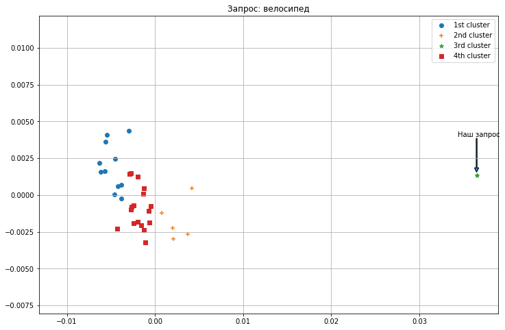
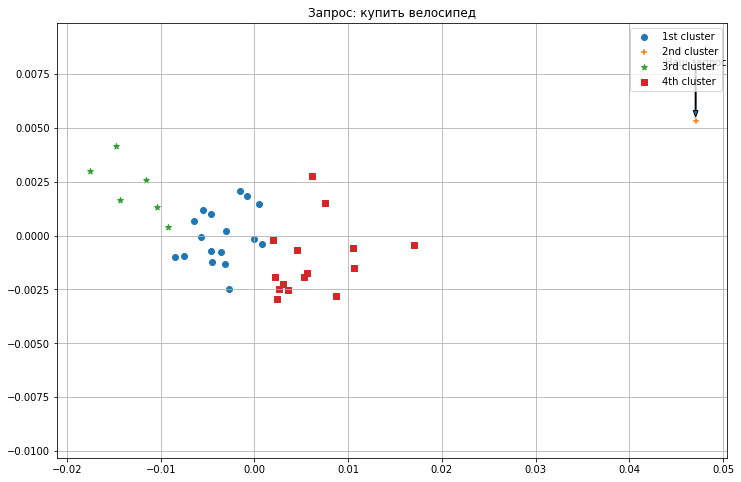
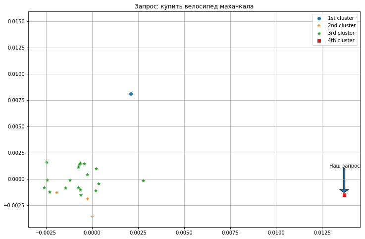
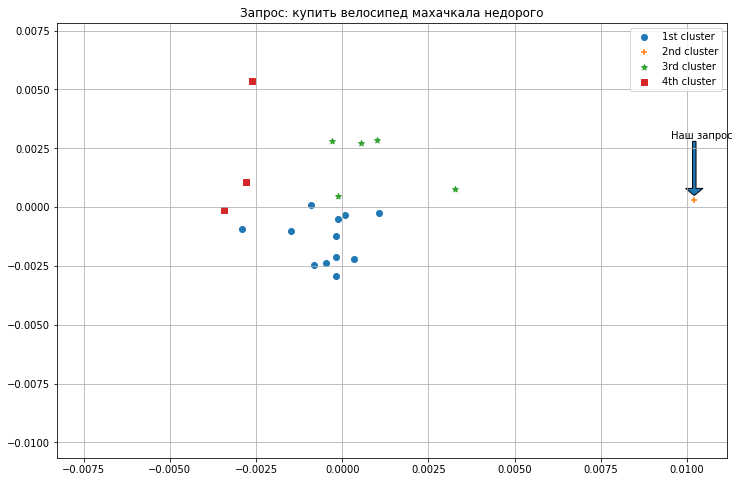
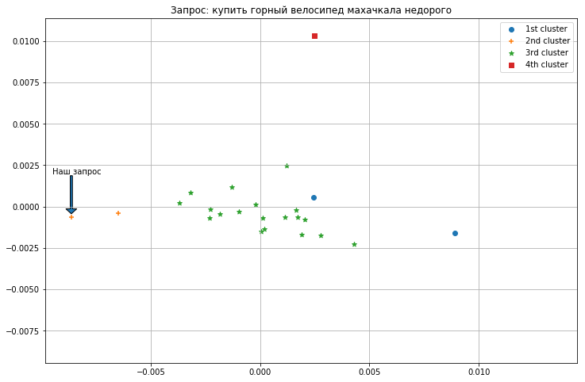
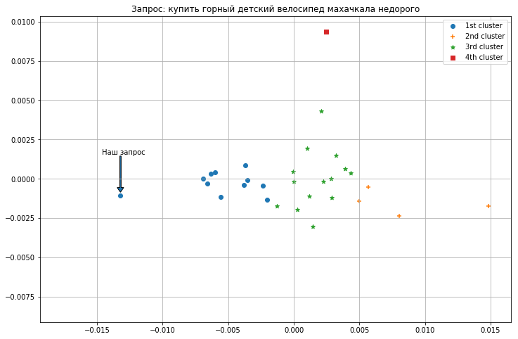

# Домашнее задание #3 (E+D)

#### Алиев М.А. 154 группа

## Ранжирование результатов поиска

### Отправка запросов к поисковику

​	В качетсве поисковой машины для обработки запросов был выбран *google.com* , для работы с ним я использовал официальную клиентскую библиотеку, написанную на *python*. Полученные сниппеты ответов, однако, пока не готовы для анализа, т.к их необходимо лемматизировать. Для этого был использован морфологичекий анализатор *Mystem*, разработанный яндексом (была попытка использовать не менее известный *pymorphy2*, однако *mystem*, в отличие от первого, умел работать с non-ascii символами, распозновая например слово "Велосипе́д" - а именно символ 'е́', с которым *pymorphy2* не справился, а также самостоятельно парсил текст на токены, которые потом и лемматизировал).

### Создание tf-idf модели и ранжировние выдачи

​	Для создания *tf-idf* модели я выбрал *TfidfVectorizer* пакета *scikit-learn*, немного дополнив его собственным паттерном по поиску токенов, т.к из коробки он ищет в тексте любую последовательно букв, в том числе и английских, что давало на выходе очень много мусора - разнообразной нерелевантной рекламы, сокращений, уникальных, не относящихся к запросу слов.

​	Получив для каждого сниппета и запроса *tf-idf* вектор, я самостоятельно отсортировал их по релевантности, в качестве метрики использовав разные методы рассчета расстояния между векторами, а именно: расстояние Чебышева, евклидово расстояние, косинусную меру, а также просто скалярное произведение векторов. Для оценки близости моей ранжировки к оригинальной, я использовал *MAE* и *MSLE* метрики. Все результаты приведены ниже:

```
    Current request: "велосипед"
       Google   |    Dot     | Euclidean  | Chebyshev  |   Cosine   
        MSLE    |    1.52    |    0.92    |    0.99    |    0.99    
        MAE     |    7.30    |    5.10    |    5.70    |    5.70    
    _________________________________________________________________
         0      |     15     |     3      |     3      |     3      
         1      |     5      |     5      |     19     |     19     
         2      |     13     |     19     |     2      |     2      
         3      |     12     |     2      |     6      |     6      
         4      |     7      |     6      |     1      |     1      
         5      |     17     |     1      |     18     |     18     
         6      |     4      |     18     |     8      |     8      
         7      |     0      |     8      |     9      |     9      
         8      |     14     |     9      |     10     |     10     
         9      |     16     |     10     |     11     |     11     
         10     |     11     |     11     |     16     |     16     
         11     |     10     |     16     |     14     |     14     
         12     |     9      |     14     |     0      |     0      
         13     |     8      |     0      |     4      |     4      
         14     |     18     |     4      |     17     |     17     
         15     |     1      |     17     |     7      |     7      
         16     |     6      |     7      |     12     |     12     
         17     |     2      |     12     |     5      |     13     
         18     |     19     |     13     |     13     |     15     
         19     |     3      |     15     |     15     |     5      


```
    Current request: "купить велосипед"
       Google   |    Dot     | Euclidean  | Chebyshev  |   Cosine   
        MSLE    |    1.86    |    0.64    |    0.62    |    0.64    
        MAE     |    8.00    |    4.70    |    4.40    |    4.70    
    _________________________________________________________________
         0      |     18     |     7      |     7      |     7      
         1      |     12     |     0      |     0      |     0      
         2      |     15     |     2      |     3      |     2      
         3      |     10     |     16     |     14     |     16     
         4      |     6      |     14     |     2      |     14     
         5      |     13     |     4      |     4      |     4      
         6      |     19     |     3      |     17     |     3      
         7      |     5      |     1      |     11     |     1      
         8      |     9      |     17     |     8      |     17     
         9      |     8      |     11     |     1      |     11     
         10     |     11     |     8      |     5      |     8      
         11     |     17     |     9      |     16     |     9      
         12     |     1      |     5      |     15     |     5      
         13     |     3      |     19     |     9      |     19     
         14     |     4      |     13     |     12     |     13     
         15     |     14     |     6      |     10     |     6      
         16     |     16     |     10     |     18     |     10     
         17     |     2      |     15     |     6      |     15     
         18     |     0      |     12     |     13     |     12     
         19     |     7      |     18     |     19     |     18     


```    
    Current request: "купить велосипед махачкала"
       Google   |    Dot     | Euclidean  | Chebyshev  |   Cosine   
        MSLE    |    1.61    |    0.56    |    0.88    |    0.56    
        MAE     |    6.59    |    4.12    |    5.29    |    4.12    
    _________________________________________________________________
         0      |     8      |     0      |     0      |     0      
         1      |     15     |     6      |     4      |     6      
         2      |     11     |     3      |     13     |     3      
         3      |     14     |     13     |     10     |     13     
         4      |     1      |     4      |     14     |     4      
         5      |     9      |     12     |     12     |     12     
         6      |     5      |     2      |     11     |     2      
         7      |     7      |     10     |     9      |     10     
         8      |     16     |     16     |     8      |     16     
         9      |     10     |     7      |     7      |     7      
         10     |     2      |     5      |     6      |     5      
         11     |     12     |     9      |     5      |     9      
         12     |     4      |     1      |     3      |     1      
         13     |     13     |     14     |     2      |     14     
         14     |     3      |     11     |     1      |     11     
         15     |     6      |     15     |     15     |     15     
         16     |     0      |     8      |     16     |     8      


```

    Current request: "купить велосипед махачкала недорого"
       Google   |    Dot     | Euclidean  | Chebyshev  |   Cosine   
        MSLE    |    1.73    |    0.56    |    0.96    |    0.56    
        MAE     |    6.82    |    3.88    |    6.00    |    3.88    
    _________________________________________________________________
         0      |     8      |     2      |     0      |     2      
         1      |     14     |     0      |     13     |     0      
         2      |     10     |     15     |     4      |     15     
         3      |     16     |     13     |     15     |     13     
         4      |     12     |     4      |     14     |     4      
         5      |     9      |     7      |     12     |     7      
         6      |     5      |     3      |     11     |     3      
         7      |     6      |     1      |     9      |     1      
         8      |     11     |     11     |     8      |     11     
         9      |     1      |     6      |     6      |     6      
         10     |     3      |     5      |     5      |     5      
         11     |     7      |     9      |     3      |     9      
         12     |     4      |     12     |     2      |     12     
         13     |     13     |     16     |     1      |     16     
         14     |     15     |     10     |     7      |     10     
         15     |     0      |     14     |     16     |     14     
         16     |     2      |     8      |     10     |     8      


```
    Current request: "купить горный велосипед махачкала недорого"
       Google   |    Dot     | Euclidean  | Chebyshev  |   Cosine   
        MSLE    |    1.61    |    0.71    |    1.23    |    0.71    
        MAE     |    7.40    |    5.80    |    7.20    |    5.80    
    _________________________________________________________________
         0      |     7      |     1      |     0      |     1      
         1      |     10     |     15     |     17     |     15     
         2      |     16     |     3      |     16     |     3      
         3      |     9      |     0      |     15     |     0      
         4      |     19     |     8      |     14     |     8      
         5      |     6      |     18     |     13     |     18     
         6      |     5      |     17     |     12     |     17     
         7      |     14     |     12     |     11     |     12     
         8      |     13     |     4      |     10     |     4      
         9      |     11     |     2      |     9      |     2      
         10     |     2      |     11     |     8      |     11     
         11     |     4      |     13     |     7      |     13     
         12     |     12     |     14     |     6      |     14     
         13     |     17     |     5      |     5      |     5      
         14     |     18     |     6      |     4      |     6      
         15     |     8      |     19     |     3      |     19     
         16     |     0      |     9      |     2      |     9      
         17     |     3      |     16     |     1      |     16     
         18     |     15     |     10     |     18     |     10     
         19     |     1      |     7      |     19     |     7      


```
    Current request: "купить горный детский велосипед махачкала недорого"
       Google   |    Dot     | Euclidean  | Chebyshev  |   Cosine   
        MSLE    |    1.69    |    1.03    |    0.54    |    1.03    
        MAE     |    8.00    |    5.00    |    5.20    |    5.00    
    _________________________________________________________________
         0      |     8      |     14     |     0      |     14     
         1      |     19     |     17     |     2      |     17     
         2      |     13     |     3      |     3      |     3      
         3      |     7      |     5      |     6      |     5      
         4      |     18     |     1      |     17     |     1      
         5      |     15     |     0      |     16     |     0      
         6      |     12     |     6      |     14     |     6      
         7      |     9      |     10     |     12     |     10     
         8      |     2      |     11     |     11     |     11     
         9      |     16     |     4      |     10     |     4      
         10     |     4      |     16     |     9      |     16     
         11     |     11     |     2      |     8      |     2      
         12     |     10     |     9      |     5      |     9      
         13     |     6      |     12     |     4      |     12     
         14     |     0      |     15     |     1      |     15     
         15     |     1      |     18     |     18     |     18     
         16     |     5      |     7      |     19     |     7      
         17     |     3      |     13     |     7      |     13     
         18     |     17     |     19     |     15     |     19     
         19     |     14     |     8      |     13     |     8   

### Интерпретация результатов

1. Как видно из результатов, наихудший результат дало простое скалярное перемножение векторов, что, впрочем, неудивительно, эта метрика не имела много смысла.

2. Далее, немногим лучше сработало расстояние Чебышева, однако этот результат тоже легко интерпретировать - расстоянием считается максимальная разность по модуль между i-ой координатой n-мерного вектора, таким образом в сниппете достаточно появиться уникальному слову, чтобы именно оно определяло расстояние. В итоге почти для каждого сниппета метрика выдала один и тот же результат и сортировка вернула почти полностью случайный порядок (например для последнего примера *MSLE* составила 0.54, что лучше, чем у всех остальных, однако в файле с кодом я продемнстрировал метрики, полученные с помощью расстояния Чебышева, где отчетливо видно, что числа почти везде одни и те же, и что эта расстановка не более чем удача).

3. Наиболее продуктивным для таких задач является поиск косинусной меры, или же измерение угла между векторами, так как в расчет не берется длина вектора, подверженная изменению количеством слов (пример: в док.1 искомое слово может встречаться чаще, а значит док.1 более близок к нашей теме, однако возможен случай, когда док.2 просто напросто больше в размере и абсолютное кол-во употреблений нашего слова там выше, при этом в контексте этого документа оно довольно редко встречается; в таком случае выиграет 2ой документ, что неверно. Косинусная мера решает эту проблему)
4. Последней метрикой является евклидово расстояние, которое как раз и подвержено проблеме, описанной в пункте выше, однако вектора, возвращаемые *tf-idf* моделью, нормализованы, что и привело к тому, что результат стал идентичен косинусной мере.

Хоть о полном повторении успехов *google* речи не идет, но мне удалось добиться определенных результатов. Все-таки для полноценной 'осмысленной' ранжировки результатов одной статистической tf-idf модели мало - *google* использует в своей работе много дополнительных метаданных, а также более сложные метрики и технологии машинного обучения.

## Кластеризация результатов поиска

Так как большинство функций, нужных для проведения кластеризации уже были написаны в предыдущем пункте, было решено дополнить работу.

​	Запросы были использованы те же, что и ранее, с единственным изменением - теперь для каждого запроса было получено по 40 ответов вместо 20. Полученные тексты как и ранее были лемматизированы, а затем токенизированы. Полученный список текстов (где каждый текст представлен в виде набора токенов) был использован для обучения *Word2Vec* модели из библиотеки для работы с текстом *gensim*. В итоге каждый текст был представлен как вектор, полученный усреднением векторов всех входящих в него слов.

​	Далее, для кластеризации была использована модель *KMeans(n_clusters=4)* из того же *scikit-learn* (число 4 было выбрано банальным перебором вариантов от 1 до 10), в качестве меры близости она использует евклидово расстояние. Для визуализации размерность векторов была понижена со 150 до 2 с помощью модели *PCA*.
















